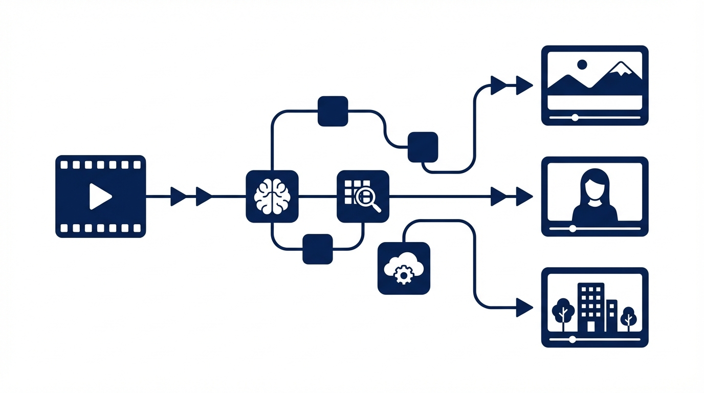
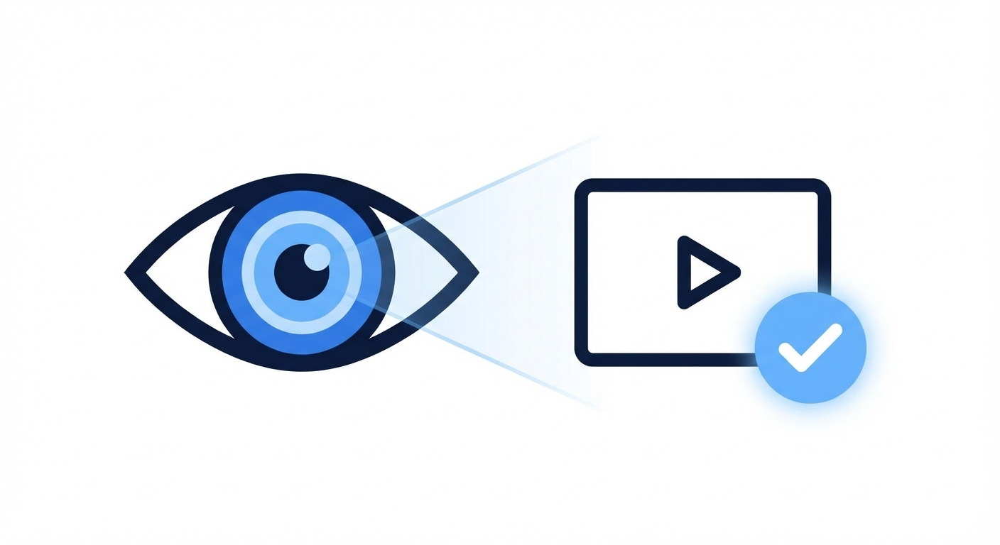

# Cover Generator

<p align="center">
  
</p>

<p align="center">
  AI-powered video thumbnail batch generator — from raw video to polished covers, fully automated.
</p>

<p align="center">
  
  
  
  
</p>

---

## What it does

Drop in a video file (or paste a script), pick your templates, and get production-ready thumbnails — in parallel, with AI quality review and auto-correction built in.

<p align="center">
  
</p>

## Pipeline

```
Video / Script / Title
        │
        ▼
  [Whisper] Transcribe audio
        │
        ▼
  [gemini-flash] Generate viral title
        │
        ├── Template A ──┐
        ├── Template B ──┤  up to 5 parallel
        ├── Template C ──┘
        │
        ▼
  Phase 1 · Element adaptation   (titles, image prompts, backgrounds)
  Phase 2 · Image generation     (gemini-image-pro)
  Phase 3 · Quality review       (auto-retry up to 3×)
        │
        ▼
  ✓ Final covers
```

## Features

| | |
|---|---|
| **Multi-template batch** | Up to 5 templates rendered in parallel |
| **Video → script** | Auto audio extraction + Whisper transcription |
| **Viral title generation** | Platform-aware (Bilibili / YouTube) |
| **Two-phase generation** | Element adaptation first → consistent style |
| **Style transfer** | Reference image or text description |
| **Self-healing quality loop** | AI reviewer auto-retries with feedback (max 3×) |
| **Asset library** | Characters / logos auto-injected into covers |
| **Real-time progress** | Live log streaming per template |

<p align="center">
  
</p>

## Quick Start

```bash
npm install
cp .env.example .env.local   # add your API key
mkdir -p public/uploads/{templates,covers,frames}
npm run dev
```

Open http://localhost:3000

## Configuration

```env
AI_BASE_URL=https://your-openai-compatible-api/v1
AI_API_KEY=your-key
ANALYSIS_MODEL=gemini-3-flash-preview
IMAGE_GEN_MODEL=gemini-3-pro-image-preview
```

Any OpenAI-compatible endpoint works (Gemini, Qwen, etc.).

## Usage

```
① Templates  →  upload template images  →  AI analyzes element structure
② Resources  →  upload character/logo assets  →  organize by category
③ Generate:
     Step 1  paste script or upload video + choose output ratio
     Step 2  select templates (multi-select)
     Step 3  choose resource categories + generation options
     Step 4  optional style reference image or description
     → Start → watch live progress → download covers
```

<p align="center">
  
</p>

## Tech Stack

| Layer | Technology |
|---|---|
| Framework | Next.js 15 + TypeScript + React 19 |
| Styling | Tailwind CSS 4 |
| Database | SQLite (better-sqlite3, WAL mode) |
| AI API | OpenAI-compatible |
| Transcription | Whisper |
| Video | ffmpeg |

## Why self-hosted?

No per-cover SaaS fees. Your video content never leaves your infrastructure. Swap models freely.

## License

MIT
