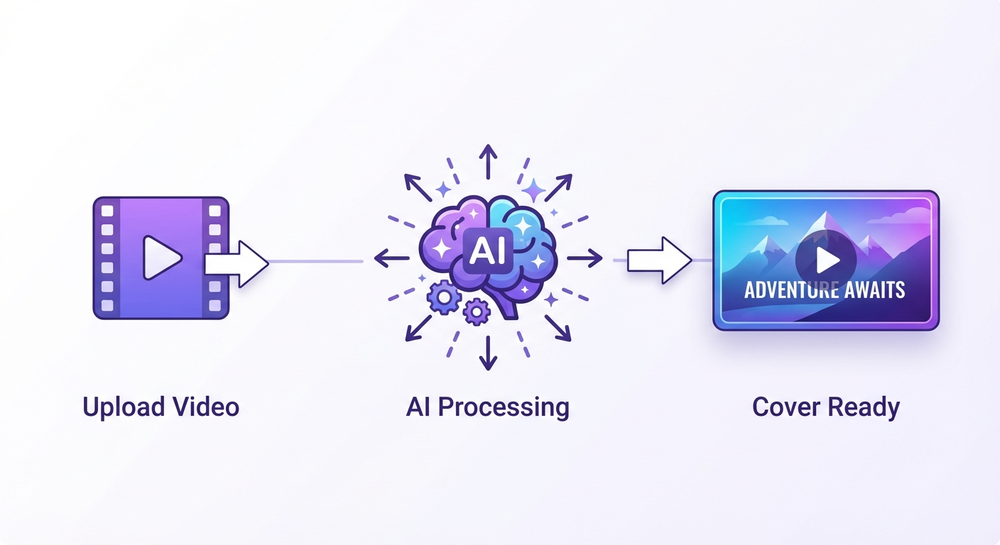
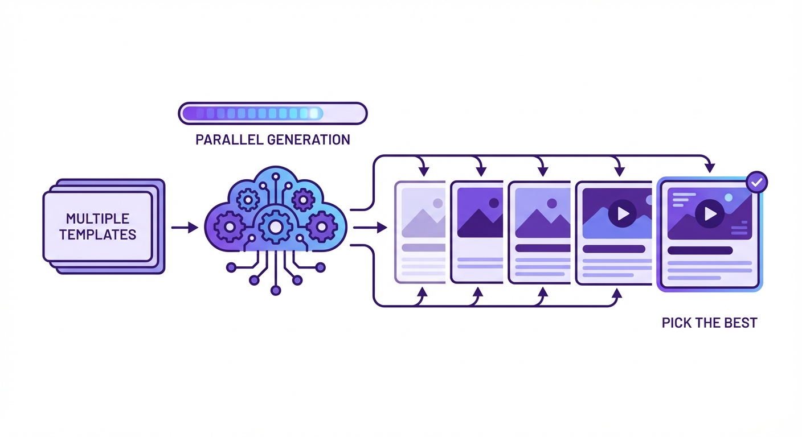

[中文](./README.zh.md) | **English**

<div align="center">


# Cover Generator

**YOUR VIDEO DESERVES A BETTER COVER**

[]()
[]()
[]()
[]()

[Features](#-features) · [How It Works](#-how-it-works) · [Quick Start](#-quick-start) · [中文](./README.zh.md)

</div>

---

**Cover Generator** is an *AI-powered thumbnail generation tool* for video creators. Upload your video — the AI transcribes it, writes a viral title, and generates a polished cover image in minutes. No design skills required.

## ✨ Features

- **Video-to-cover automation** — Upload a video; Whisper transcribes it, AI writes the title, cover is generated end-to-end.
- **Self-correcting AI review loop** — Generated covers are auto-reviewed and regenerated up to 3 times until they pass quality checks.
- **Template learning** — Upload a reference cover once; the AI learns your style and reuses it forever.
- **Smart asset library** — Store logos, characters, and backgrounds; AI picks the best match for each video automatically.
- **Parallel batch generation** — Run up to 5 templates simultaneously and pick your favorite.
- **Multi-ratio support** — Output in 16:9, 4:3, 1:1, 9:16, and more — ready for any platform.

## 🖼 How It Works

<div align="center">

</div>

Upload your video. Whisper extracts and transcribes the audio. The AI analyzes the transcript, generates a punchy title, then produces a cover image — all in one automated pipeline.

<div align="center">

</div>

Select multiple templates and generate up to 5 covers in parallel. Compare results side-by-side and publish the one that fits best.

<div align="center">

</div>

Every cover goes through an AI review pass. If it doesn't meet the quality bar, the system automatically retries with feedback — up to 3 times — before surfacing the result.

## 🚀 Quick Start

```bash
npm install
cp .env.example .env.local   # fill in AI_BASE_URL and AI_API_KEY
mkdir -p public/uploads/{templates,covers,frames}
npm run dev
```

Open [http://localhost:3000](http://localhost:3000).

## 🛠 Tech Stack

| Layer | Technology |
|---|---|
| Framework | Next.js 16 + TypeScript + React 19 |
| Styling | Tailwind CSS 4 |
| Database | SQLite (better-sqlite3, WAL mode) |
| AI Models | Gemini flash + pro-image (OpenAI-compatible API) |
| Transcription | Whisper |
| Video processing | ffmpeg |

## License

MIT
