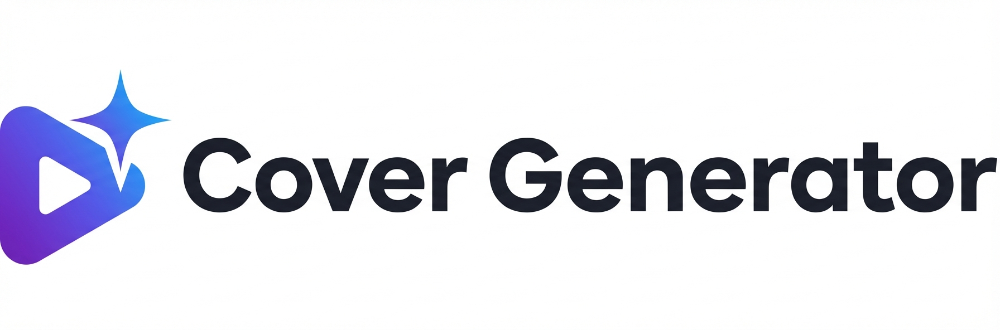

**中文** | [English](./README.md)

<div align="center">



# Cover Generator — 封面生成器

**YOUR VIDEO DESERVES A BETTER COVER**

[]()
[]()
[]()
[]()

[功能特性](#-功能特性) · [工作原理](#-工作原理) · [快速开始](#-快速开始) · [English](./README.md)

</div>

---

**封面生成器**是面向视频创作者的 *AI 驱动封面自动生成工具*。上传视频，AI 自动转录、生成爆款标题、输出精美封面——全程无需设计技能。

## ✨ 功能特性

- **视频一键生成封面** — 上传视频，Whisper 自动转录，AI 生成标题，端到端全自动出图。
- **AI 自动审核重试** — 每张封面经 AI 质量审核，不达标自动带反馈重试，最多 3 次。
- **模板风格学习** — 上传一次参考封面，AI 学习你的风格，后续永久复用。
- **智能素材库** — 存储 Logo、人物、背景素材，AI 自动为每个视频匹配最合适的资源。
- **多模板并行生成** — 最多同时跑 5 套模板，对比挑选最佳结果。
- **多比例输出** — 支持 16:9、4:3、1:1、9:16 等多种比例，适配各大平台。

## 🖼 工作原理

<div align="center">

</div>

上传视频后，Whisper 提取音频并转录文案，AI 分析内容生成爆款标题，再自动生成封面图——一条流水线全部搞定。

<div align="center">

</div>

选择多套模板，最多 5 个并行生成。结果并排对比，选出最满意的一张直接发布。

<div align="center">

</div>

每张封面都经过 AI 审核。不合格时系统自动附上反馈重新生成，最多重试 3 次，确保质量达标再呈现给你。

## 🚀 快速开始

```bash
npm install
cp .env.example .env.local   # 填写 AI_BASE_URL 和 AI_API_KEY
mkdir -p public/uploads/{templates,covers,frames}
npm run dev
```

访问 [http://localhost:3000](http://localhost:3000)。

## 🛠 技术栈

| 层级 | 技术 |
|---|---|
| 前端框架 | Next.js 16 + TypeScript + React 19 |
| 样式 | Tailwind CSS 4 |
| 数据库 | SQLite（better-sqlite3，WAL 模式） |
| AI 模型 | Gemini flash + pro-image（OpenAI 兼容 API） |
| 语音转录 | Whisper |
| 视频处理 | ffmpeg |

## License

MIT
