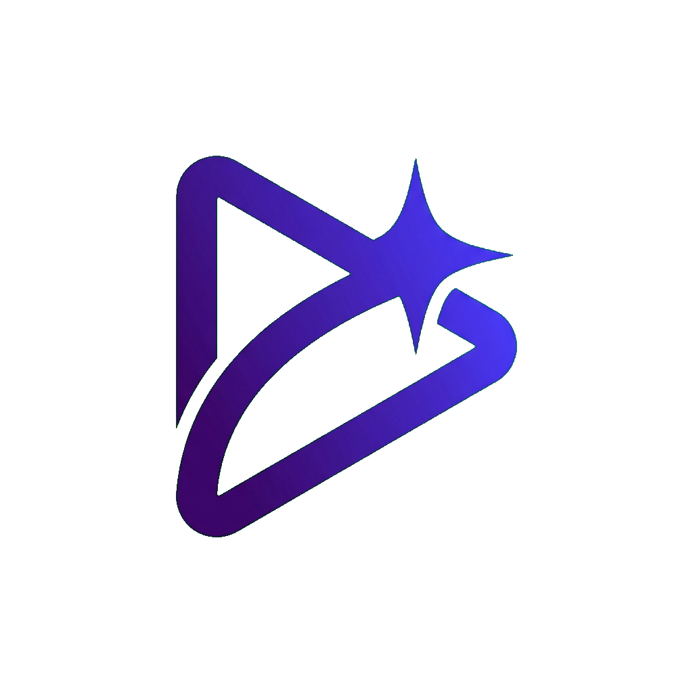
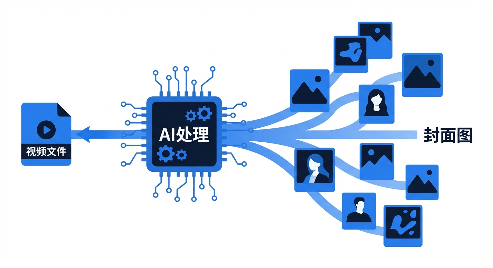
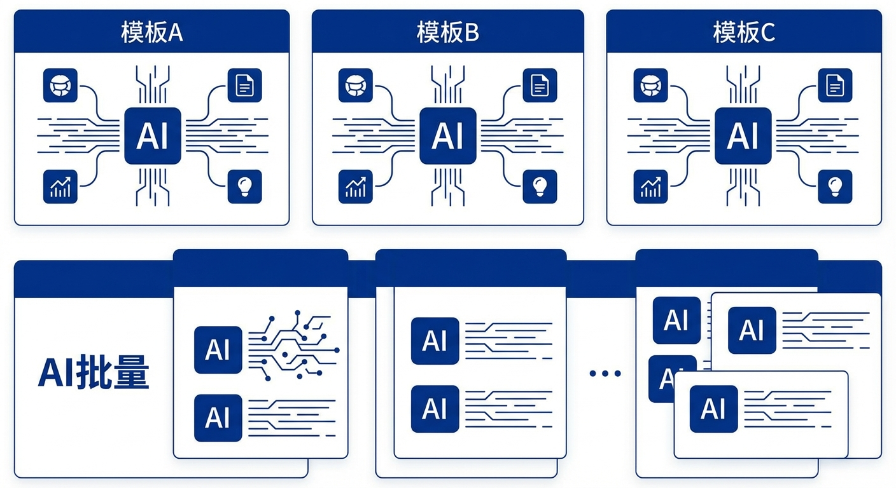
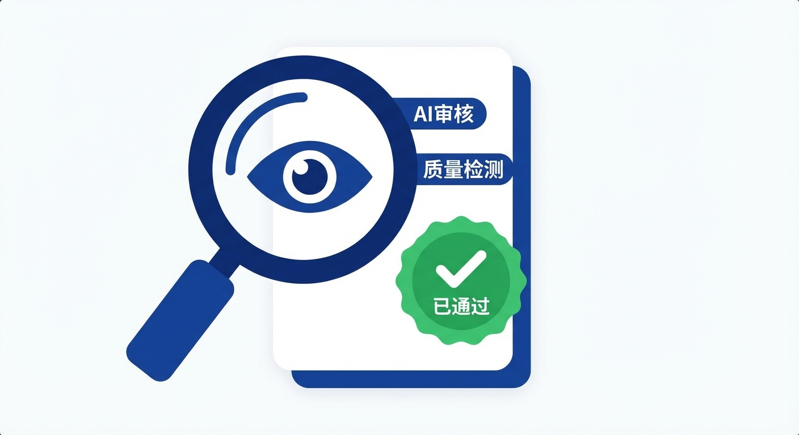

**中文** | [English](./README.md)

# Cover Generator — AI 视频封面生成器

<p align="center">
  
</p>

<p align="center">
  基于 AI 的视频封面批量生成工具，支持多模板并行、风格迁移、自动质量审核。
</p>

<p align="center">
  
  
  
  
</p>

---

## 是什么

上传视频文件（或粘贴文案），选好模板，自动生成多套可发布的封面图——多模板并行处理，内置 AI 质量审核与自动修正。

<p align="center">
  
</p>

## 生成原理

```
视频文件 / 文案 / 标题
        │
        ▼
  [Whisper] 提取音频 → 转录文案
        │
        ▼
  [gemini-flash] 生成爆款标题
        │
        ├── 模板 A ──┐
        ├── 模板 B ──┤  最多 5 并发
        ├── 模板 C ──┘
        │
        ▼
  Phase 1 · 元素适配   （标题文案、图片描述、背景）
  Phase 2 · 图片生成   （gemini-image-pro）
  Phase 3 · 质量审核   （不合格自动重试，最多 3 次）
        │
        ▼
  ✓ 封面图片
```

## 功能特性

| | |
|---|---|
| **多模板并行** | 最多 5 个模板同时生成 |
| **视频转文案** | 自动提取音频，Whisper 转录 |
| **爆款标题生成** | 针对 B 站 / YouTube 平台优化 |
| **两阶段生成** | 先适配元素内容，再生成图片，风格更统一 |
| **风格迁移** | 上传参考图或文字描述风格 |
| **自动质量审核** | AI 检测不合格自动带反馈重试（最多 3 次） |
| **资源库** | 人物 / Logo 素材自动注入封面 |
| **实时进度** | 每个模板独立日志流式展示 |

<p align="center">
  
</p>

## 快速开始

```bash
npm install
cp .env.example .env.local
mkdir -p public/uploads/{templates,covers,frames}
npm run dev
```

访问 http://localhost:3000

## 环境变量

```env
AI_BASE_URL=https://your-api/v1
AI_API_KEY=your-key
ANALYSIS_MODEL=gemini-3-flash-preview
IMAGE_GEN_MODEL=gemini-3-pro-image-preview
```

## 使用流程

```
① 模板库  →  上传封面模板图  →  AI 分析元素结构
② 资源库  →  上传人物/Logo 素材  →  分类管理
③ 生成封面：
     Step 1  输入文案 / 上传视频  +  选择输出比例
     Step 2  选择模板（可多选）
     Step 3  选择资源分类  +  生成选项
     Step 4  风格参考图 / 风格描述（可选）
     → 开始生成 → 实时查看进度 → 下载封面
```

<p align="center">
  
</p>

## 技术栈

| 层级 | 技术 |
|---|---|
| 前端框架 | Next.js 15 + TypeScript + React 19 |
| 样式 | Tailwind CSS 4 |
| 数据库 | SQLite（better-sqlite3，WAL 模式） |
| AI 接口 | OpenAI 兼容 API |
| 语音转录 | Whisper |
| 视频处理 | ffmpeg |

## License

MIT
